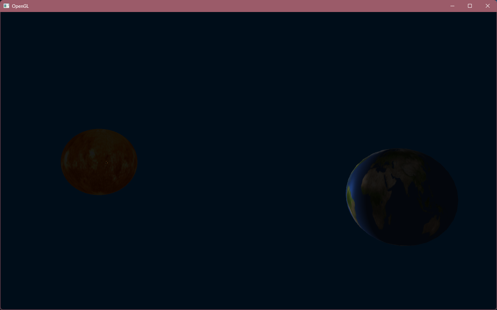

# Solar System Simulation

This project is a simple 3D solar system simulation created using C++ and OpenGL. The program currently renders stationary planets, with a UV-sphere projection, and corresponding textures for each planet. Additionally, camera movement is enabled to navigate through the scene.

## Features

- **Stationary Planets:** 3D mesh of planets with corresponding textures.
- **UV Sphere Projection:** Planets are represented by UV spheres, which are mapped with textures.
- **Camera Movement:** Interactive camera controls to navigate the scene.

## Current Technologies Used

- **C++** for core programming.
- **OpenGL** for rendering the 3D scene.
- **GLFW** for window creation and input handling.
- **GLM** for math operations (transformations, projections, etc.).

## Screenshots

  
*Description of what this image shows (e.g., "A screenshot of the scene showing stationary planets with their textures.")*

## Future Plans

The following features are planned for future updates:

- **Planets Orbiting:** Implementing orbital mechanics for the planets to orbit around a central star.
- **Lighting System:** Adding dynamic lighting and shadows to improve the scene's realism.
- **User Interface (UI):** Adding an on-screen interface to display relevant information (e.g., planet names, distance from the sun).
- **Interactivity:** Introducing interactive elements, such as allowing the user to click on planets to get more information or to move them.

## Installation

### Requirements

- C++17 or later
- OpenGL 3.3 or later
- GLFW
- GLAD
- GLM

### Build Instructions

1. Clone the repository:

   ```bash
   git clone https://github.com/your-username/solar-system-simulation.git
   cd solar-system-simulation
   
2. Install dependencies (GLFW, GLM, etc.) if not already installed. You can use a package manager like vcpkg or install them manually.

3. Build the project:
bash
Copy code
mkdir build
cd build
cmake ..
make

4. Run the simulation:

bash
Copy code
./solar_system_simulation


### Contributing
If you'd like to contribute to this project, feel free to open an issue or submit a pull request. Please ensure your code adheres to the project's coding standards and you write tests for new features.

### License
This project is licensed under the CC0 1.0 Universal (Public Domain Dedication) license. You can freely use, modify, and distribute the project for any purpose without restrictions. For more details, see the [LICENSE](LICENSE) file.
